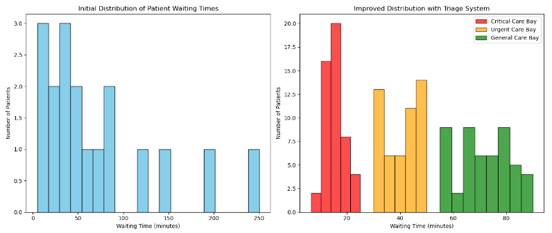

# Improving Patient Waiting Times
> **Brief Description:** - A healthcare facility observed decreasing patient satisfaction related to extended and variable waiting times. To address this issue, the facility's data science team collected and analyzed waiting time data over a month to identify underlying problems and implement improvements.
> 


---

## Table of Contents

- [Description](#description)
- [Video Explanation](#video)
- [Technologies Used](#technologies-used)
- [Dataset](#dataset)
- [Program Codes ](#program-codes)
- [Screenshots](#screenshots)
- [Contribution](#contributipn)
- [Contact Details](#contact-details)

---

## Description

A healthcare facility observed decreasing patient satisfaction related to extended and variable waiting times. To address this issue, the facility's data science team collected and analyzed waiting time data over a month to identify underlying problems and implement improvements.

### About Data Collection
Data on patient waiting times from check-in to consultation were collected, including:

- Patient ID
- Check-in time
- Consultation start time
- Date of visit
- Initial Analysis
- A histogram was created to visualize the distribution of waiting times.

### Findings:

The histogram revealed a right-skewed distribution of waiting times, with a significant number of patients experiencing long waits (up to 250 minutes).

### Statistical Summary:
- Mean Waiting Time: 60 minutes
- Median Waiting Time: 25 minutes
- Standard Deviation: 50 minutes

The skewed distribution indicated inefficiencies in the patient flow process, contributing to patient dissatisfaction.

### Action Plan :
To address these issues, the facility implemented a triage system, categorizing patients based on the severity and type of their conditions.

### Steps Taken:

#### Initial Assessment: A quick assessment upon arrival determined the severity and type of each patient's condition.
1. Categorization: Patients were divided into three bays:
   - Critical Care Bay: For life-threatening conditions.
   - Urgent Care Bay: For serious but non-life-threatening conditions.
   - General Care Bay: For non-urgent conditions. 
   
2. Dedicated Teams: Each bay was staffed with medical professionals specialized in handling specific types of conditions.

3. Continuous Monitoring: Patients' conditions were monitored, and they were moved to different bays if necessary.

4. Clear Communication: Patients were informed about the triage process and expected waiting times, reducing anxiety and improving satisfaction.

### Improved Situation
After three months, a new histogram was created to visualize the improved distribution of waiting times.

## Video

[](https://www.youtube.com/watch?v=1EkTVx3xw9o) 

## Technologies-used

Python programming language, numpy and matplotlib package.

## Dataset

The dataset has been generated by the program itself tom mimic the scenario. However, it is recommended that for real life analysis actual data should be collected and processed properly to get realistic results.

```python
import matplotlib.pyplot as plt
import numpy as np

# Initial waiting time data (in minutes)
initial_waiting_times = [5, 10, 15, 20, 25, 30, 35, 40, 45, 50, 60, 70, 80, 90, 120, 150, 200, 250]

# Improved waiting time data with triage system for different bays
# Adding some variability within each bay to reflect more realistic distributions

# Critical Care Bay: Shorter waiting times with less variability
critical_care_waiting_times = np.random.normal(loc=15, scale=5, size=50).clip(min=5, max=25)

# Urgent Care Bay: Moderate waiting times with moderate variability
urgent_care_waiting_times = np.random.normal(loc=40, scale=10, size=50).clip(min=30, max=50)

# General Care Bay: Longer waiting times with more variability
general_care_waiting_times = np.random.normal(loc=70, scale=10, size=50).clip(min=55, max=90)
```

## Program-codes

```python
import matplotlib.pyplot as plt
import numpy as np

# Initial waiting time data (in minutes)
initial_waiting_times = [5, 10, 15, 20, 25, 30, 35, 40, 45, 50, 60, 70, 80, 90, 120, 150, 200, 250]

# Improved waiting time data with triage system for different bays
# Adding some variability within each bay to reflect more realistic distributions

# Critical Care Bay: Shorter waiting times with less variability
critical_care_waiting_times = np.random.normal(loc=15, scale=5, size=50).clip(min=5, max=25)

# Urgent Care Bay: Moderate waiting times with moderate variability
urgent_care_waiting_times = np.random.normal(loc=40, scale=10, size=50).clip(min=30, max=50)

# General Care Bay: Longer waiting times with more variability
general_care_waiting_times = np.random.normal(loc=70, scale=10, size=50).clip(min=55, max=90)

# Plotting the initial and improved situations
plt.figure(figsize=(14, 6))

# Initial situation
plt.subplot(1, 2, 1)
plt.hist(initial_waiting_times, bins=20, edgecolor='black', color='skyblue')
plt.title('Initial Distribution of Patient Waiting Times')
plt.xlabel('Waiting Time (minutes)')
plt.ylabel('Number of Patients')

# Improved situation with triage system
plt.subplot(1, 2, 2)
plt.hist(critical_care_waiting_times, bins=5, edgecolor='black', color='red', alpha=0.7, label='Critical Care Bay')
plt.hist(urgent_care_waiting_times, bins=5, edgecolor='black', color='orange', alpha=0.7, label='Urgent Care Bay')
plt.hist(general_care_waiting_times, bins=8, edgecolor='black', color='green', alpha=0.7, label='General Care Bay')
plt.title('Improved Distribution with Triage System')
plt.xlabel('Waiting Time (minutes)')
plt.ylabel('Number of Patients')
plt.legend()

plt.tight_layout()
plt.show()
```

The programs are written on jupiter notebook, You may run the program on Google colab by clicking on the colab badge below. However, the output may not be generated on colab. For that you have to download the program and run it locally. Make sure that the packages are all installed.

[](https://colab.research.google.com/github/fromsantanu/Project12-STM-Improving-Patient-Waiting-Times/blob/main/Project12-STM-Improving-Patient-Waiting-Times.ipynb)

## Screenshots



## Findings:

1. The distribution became more symmetric and centered around lower waiting times.

2. Bays showed more uniform waiting times:
   - Critical Care Bay: 5-25 minutes
   - Urgent Care Bay: 30-50 minutes
   - General Care Bay: 55-90 minutes

### Outcome
The triage system led to:

- Reduced Variability: More consistent and predictable waiting times.
- Efficient Resource Use: Better allocation of medical staff and resources.
- Enhanced Patient Satisfaction: Improved patient experience and reduced frustration.

### Conclusion
By analyzing waiting time data and implementing a triage system, the healthcare facility effectively reduced waiting times and improved patient satisfaction. This case study demonstrates the importance of data-driven decision-making in enhancing healthcare delivery.

## Contribution

The programs are written by Santanu Karmakar

## Contact-details

If you wish to contact me, please leave a message (Preferably WhatsApp) on this number: 6291 894 897.
Please also mention why you are contacting me. Include your name and necessary details.
Thank you for taking an interest.
